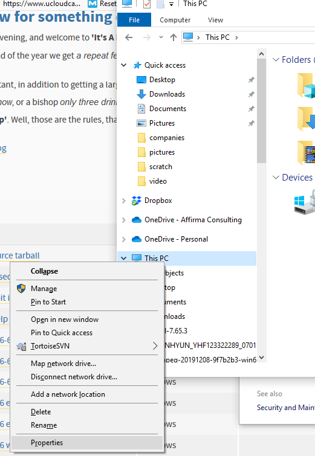
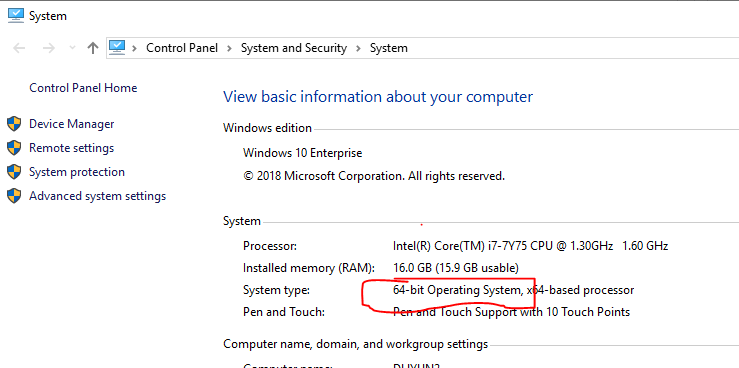

# Installing Visual Studio Code for Python

1. [Download](https://code.visualstudio.com/download) Visual Studio Code and install
2. [Download](https://www.python.org/downloads/) latest version of Python
    - Click on the download link of the latest version
    - Choose the appropriate version
        - Windows
            - Check to see if your system is 32-bit or 64-bit.
                - Press the [Windows Key] + [e] at the same time to bring up the File Explorer.  Right click on "This PC", then select "Properties"
                
                - Look under the System section under System Type.  This will tell you whether you are running on a 32-bt OS or a 64-bit OS.
                
            - If you are on a 64-bit OS, download and install:
                > Windows x86-64 executable installer
            - If you are a on 32-bit OS, download and install: 
                > Windows x86 executable installer
        - Mac
            - Download and install:
                > macOS 64-bit installer
        
    - If the installer asks you Install Now or Custom Install, choose "Install Now"
3. Open up Visual Studio Code
4. On the left Toolbar, click on the Extensions icon (5th icon from the top). (Or type CTRL+SHIFT+X)

5. In the extension search bar, type in:
    > Python
6. Click on the "Python" extension by Microsoft.

7. Click on the green "Install" button
8. Click on the "Explorer" icon in the Left Toolbar (or CTRL+SHIFT+e).
9. Click on Open Folder
10. Create a new Folder, Name it Python, then click "Select Folder".
11. Type CTRL+n to create a new file
12. Type CTRL+s to save it.  Give it a name e.g. test.py
13. Type in the following code into the file:
    > print("Hello World")
14. Click on the small green triangle in the top right hand corner of the window.  (If you mouseover it, it will say "Run Python File in Terminal")
15. In the bottom window, you should see the file run.  The output should say "Hello World"
16. At the terminal prompt, type:
    >pip install pygame

You should be ready to go.

